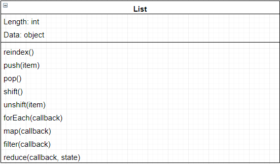

# LAB 02

## Classes, Inheritance, Functional Programming

### Jon Struve

### Links and Resources
* [submission PR](https://github.com/DeltaV401/401-lab-02/pull/1)
* [travis](https://travis-ci.com/DeltaV401/401-lab-02)

#### Documentation
No documentation used for this assignment

### Modules
#### `vehicle-class.js`
#### `vehicle-constructor.js`
#### `list.js`
#### `validator.js`
  
#### Tests
All tests for this lab were made for us.

#### UML
